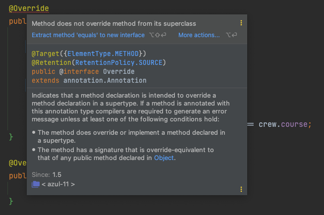

# 아이템 40. @Override 애너테이션을 일관되게 사용하라

📌핵심 정리
> - 상위 클래스의 메서드를 재정의하려는 모든 메서드에 @Override 어노테이션을 사용하자.
> - 구체 클래스에서 상위 클레스의 **추상 메서드** 를 재정의 할 떄는 굳이 **@Override** 를 달지 않아도 된다.
> 👉🏻 하지만 개인적으로는 '일관성'을 위해  어노테이션을 다는게 좋다고 생각한다.
> - 인터페이스 메서드를 구현한 메서드에도 **@Override**를 다는 것이 좋다.
> - 실수로 추가한 메서드가 없다는 것을 컴파일 시간에서 알 수 있다.⭐️


---

## 왜 @Override가 중요한가?

@Override 애너테이션은 “이 메서드는 상위 타입(클래스나 인터페이스)의 메서드를 재정의한 것이다” 라는 사실을 컴파일러와 개발자 모두에게 알려줍니다. 이를 통해 다음과 같은 이점을 얻을 수 있습니다.

1. 실수 방지
메서드를 재정의할 때 매개변수 타입이나 시그니처를 잘못 작성해 ‘오버로딩(Overloading)’을 하게 되는 경우가 종종 있습니다. @Override를 사용하면 상위 클래스나 인터페이스에 실제로 동일 시그니처의 메서드가 없으면 컴파일 에러가 발생합니다. 
2.	가독성 향상
코드 리뷰나 유지보수 관점에서, @Override 애너테이션이 있으면 “이 메서드는 상위 메서드 재정의”라는 정보를 명확히 전달합니다. 코드만 봐서는 재정의인지, 별도의 헬퍼 메서드인지 헷갈리는 것을 방지할 수 있습니다.

### overloading과 overriding 혼동??

다음은 책 아이템40에 있는 예시 코드 입니다.
```java
public class Bigram {
private final char first;
private final char second;

    public Bigram(char first, char second) {
        this.first = first;
        this.second = second;
    }

    // 의도: Object.equals를 재정의하려고 했으나...
    public boolean equals(Bigram b) {
        return b.first == first && b.second == second;
    }

    public int hashCode() {
        return 31 * first + second;
    }

    public static void main(String[] args) {
        Set<Bigram> s = new HashSet<>();
        for (int i = 0; i < 10; i++) {
            for (char ch = 'a'; ch <= 'z'; ch++) {
                s.add(new Bigram(ch, ch));
            }
        }
        System.out.println(s.size()); // 몇 개가 나올까?
    }
}
```

👉🏻	
•	코드 의도: 두 문자가 같은 Bigram이면 같은 객체로 간주하여 중복을 제거하고 싶었음

•	결과: equals(Bigram b)는 실은 Object.equals(Object o)를 재정의한 게 아니라 오버로딩한 메서드가 되어 버렸습니다.

•	HashSet은 내부적으로 객체 비교 시 Object.equals(Object) 메서드를 호출하므로, 우리가 작성한 equals(Bigram b)는 아예 호출조차 되지 않습니다.

•	결국, 모든 Bigram 객체는 기본 Object.equals()(== 비교)만 사용하게 되어, 서로 다른 객체로 인식됩니다. 따라서 중복 제거가 제대로 안 되어 예상보다 훨씬 많은 개수가 출력됩니다
-> 26를 의도 했지만 260이 출력.

이 문제를 해결하려면 Object.equals(Object o)를 제대로 재정의해야 합니다. 동시에, @Override 애너테이션을 사용해 시그니처가 올바른지 컴파일러에게 확인받으면 됩니다.

```java
@Override
public boolean equals(Object o) {
if (!(o instanceof Bigram)) {
return false;
}
Bigram b = (Bigram) o;
return b.first == first && b.second == second;
}
```
만약 실수로 위처럼 Object o 대신 Bigram b만 받도록 작성했다면, @Override 애너테이션 덕분에 아래와 같은 컴파일 에러가 발생해 문제를 즉시 파악할 수 있습니다.


즉, 잘못된 부분을 명확히 알려주므로 곧장 올바르게 수정이 가능합니다.

---

## “모든” 재정의 메서드에 달아야 할까?

@Override 사용 규칙과 예외
1. 기본 규칙: 모든 재정의 메서드에 적용
   상위 클래스 메서드 재정의 시 반드시 사용합니다.

인터페이스 메서드 재정의 시에도 적용 가능합니다.

2. 예외 상황
   구체 클래스에서 상위 추상 메서드를 구현할 때는 생략 가능합니다.
   (컴파일러가 미구현 메서드를 자동으로 체크하기 때문)


더 쉬운 말로 하면 추상메서드를 구현하지 않으면 어짜피 오류가 뜨기 때문입니다!

그런데 굳이 안 달 필요는 없는 것 같으니 다는게 좋을것 같습니다.. (사실 IDE에서 달아줍니다^^.)

3. 인터페이스와 디폴트 메서드
   인터페이스에 디폴트 메서드가 없으면 생략 가능하지만,
   명시적으로 추가하면 실수 방지에 도움이 됩니다

### 인터페이스 메서드 재정의에도 @Override를 달 수 있다

자바 6부터는 인터페이스 메서드를 구현할 때에도 @Override를 붙이는 것이 가능해졌습니다. (자바 5에서는 불가능했음)

```java
public interface State {
    State draw(Card card);
    State stay();
    boolean isRunning();
    ...
}

public final class Ready implements State {
    // State 인터페이스 메서드 모두 재정의
    @Override
    public State draw(Card card) { ... }

    @Override
    public State stay() { ... }

    @Override
    public boolean isRunning() { ... }
    ...
}
```

- 디폴트 메서드가 존재하는 인터페이스라면, 해당 메서드를 진짜 재정의했는지 시그니처까지 꼼꼼히 검증할 수 있기 때문에 실수를 줄일 수 있습니다.

-  메서드가 없는 인터페이스라면, “이 메서드가 재정의임을 알리는” 의미의 @Override를 생략하는 선택도 가능합니다. 그럼에도 불구하고 일관성을 위해 붙이는 편이 좋습니다.